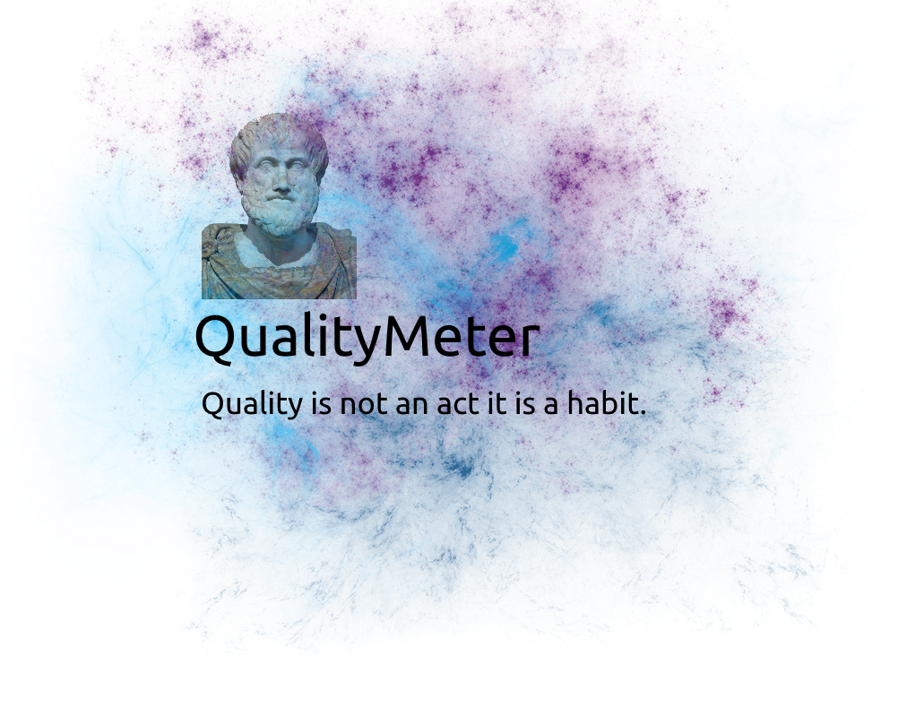

# QualityMeter

### Software quality meter toolkit

QualityMeter is a tool to compute various design quality attributes for object-oriented programs. 
Refer to the documentation website to find more information:

* [m-zakeri.github.io/QualityMeter](https://m-zakeri.github.io/QualityMeter)
